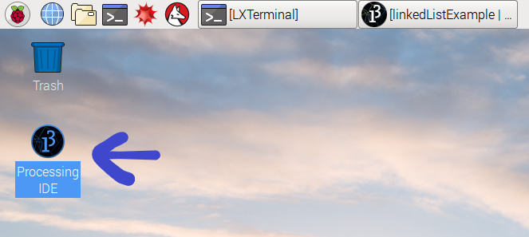

# linked-list-example

A quick-and-dirty example of a doubly-linked list in Processing.

## Look how neat. Very Wow.

## What do the numbers in the console mean?

Well, after you create 1000 `Creature`s (the circles), your average `frameRate` at that point is multiplied by 1000 (the number of `Creature`s) to give you a final benchmarking score. This should give us a good comparison cross platforms! 

## How to run this:

1. Download and install [Processing](https://processing.org/download/).
2. Clone this repository: `git clone https://github.com/b4ux1t3/linkedListExample`
3. Open it up in Processing.
4. Click the run icon.
5. Done!

If you need more info on those steps, keep reading. I will expand on each of the steps. These instructions are for installing this on a Linux-based operating system, like a Raspberry Pi running Raspbian, or any computer running Ubuntu. If you're using a different version of Linux (say, Fedora or CentOS), use whatever download utility (like `curl`) that comes with your distribution for part 1. Apart from that, everything should be the same on nearly any modern Linux distribution.

1. **Download and Install Processing:**

First, you need to get the binaries from the Processing website. You can do this manually, by going to the webpage and downloading them. Or you can just run the command:

    # Raspberry Pi
    wget http://download.processing.org/processing-3.3.5-linux-armv6hf.tgz

    # 32-Bit Operating Systems
    wget http://download.processing.org/processing-3.3.5-linux32.tgz

    # 64-Bit Operating Systems
    wget http://download.processing.org/processing-3.3.5-linux64.tgz

Once this is complete, you just need to unzip the file you got. You can do this by running the following command (keep in mind, you can press `Tab` to autocomplete the file name so you don't have to type out the whole thing!):

    tar -xf processing-3.3.5-linux{your architecture}

Once it's extracted, `cd` into the newly created `processing-3.3.5`directory. Then all you need to do is run the `install.sh` script by typing:

    ./install.sh

This does not require root, and only installs it for your current user. Congratz! You have Processing installed!

2. **Clone This Repository:**

This is relatively straightforward. You just need to have `git` installed (I'll leave you to figure out how to do that on your own. Hint: Your operating system will probably tell you how). Then you just enter the command above in your terminal wherever you would like to put theproject folder.

    git clone https://github.com/b4ux1t3/linkedListExample

Boom! Done. You now have a copy of this code.

3. **Open it up with Processing:**

When you ran the `./install.sh` script, it should have placed a shortcut on your desktop. If it didn't, start this guide over again. if it did, click on that icon, shown here. 

Open that up. This will take a while on the Pi. This is _not_ a quick process on the Pi itself.

Now all you have to do is click `File`, `Open`, and then open up any of the .pde files from the project folder that you `git clone`ed. This will open them all up in the Processing IDE.

4. **Click the Run Icon:**

No, seriously, that's all you have to do at this point. It should start to run!

5. **Done!**

:D